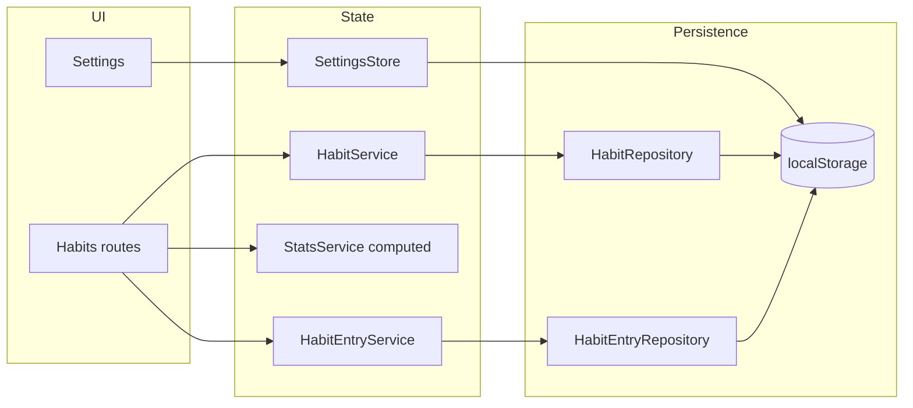

# Habit Tracker

Production-style habit tracking app built with **Angular 20**. It uses **zoneless change detection**, **signals** and **computed** state (including a small `HabitEntryStore`), **Angular Material**, **Tailwind CSS**, **ngx-translate** (EN/ES), and a **PWA** via the Angular service worker.

## Stack highlights

| Area              | Choice                                                             |
| ----------------- | ------------------------------------------------------------------ |
| Framework         | Angular 20 (standalone APIs, `ApplicationConfig`)                  |
| Change detection  | `provideZonelessChangeDetection()` (no Zone.js)                    |
| State             | Signals + `computed`; `SettingsStore`; `localStorage` repositories |
| UI                | Angular Material, Tailwind CSS 4                                   |
| i18n              | `@ngx-translate` with HTTP loader                                  |
| Offline / install | Service worker (`ngsw-config.json` in production builds)           |
| Unit tests        | **Vitest** via `@analogjs/vitest-angular`                          |
| Lint / format     | **Biome** (see `biome.json`)                                       |
| E2E               | **Playwright** (`e2e/`, `ng e2e`)                                  |
| Git hooks         | Husky + lint-staged                                                |

## Prerequisites

- Node.js 22 (recommended; CI uses 22)
- npm

## Install

```bash
npm ci
```

## Development

```bash
npm start
# → http://localhost:4200
```

## Build

```bash
npm run build
```

Production builds enable the **service worker** and bundle budgets defined in `angular.json`.

## Tests

**Unit tests** (Vitest):

```bash
npm test
```

With coverage (CI uses this):

```bash
npm test -- --coverage
```

**End-to-end** (Playwright; starts the dev server via the Angular e2e target):

```bash
npx ng e2e
```

## Linting and formatting

```bash
npm run lint      # Biome lint (with --write)
npm run check     # Biome check (lint + format)
npm run format    # Biome format only
```

## CI

The `main` branch runs Biome, Vitest with coverage, and production build on GitHub Actions; on push, deploy to Vercel is configured when `VERCEL_TOKEN` is set.

## Architecture

Data flows from **repositories** (`localStorage`-backed signals) through thin **services**, **computed stats**, and feature components. **Settings** use a dedicated `SettingsStore` with persistence; habits use `HabitRepository` / `HabitEntryRepository`. Time-sensitive logic uses an injectable **`DATE_CLOCK`**.



**Performance:** zoneless change detection, lazy-loaded routes (`loadComponent`), production service worker with runtime caching for Google Fonts (`ngsw-config.json`). Initial bundle budget is tuned in `angular.json`.

## Project layout

- `src/app/core` — `data/` repositories, `stores/`, `services/`, `lib/` pure helpers, models
- `src/app/features` — route-level features (habits, settings)
- `src/app/shared` — reusable components, pipes

## License

Private / personal portfolio project unless stated otherwise.
